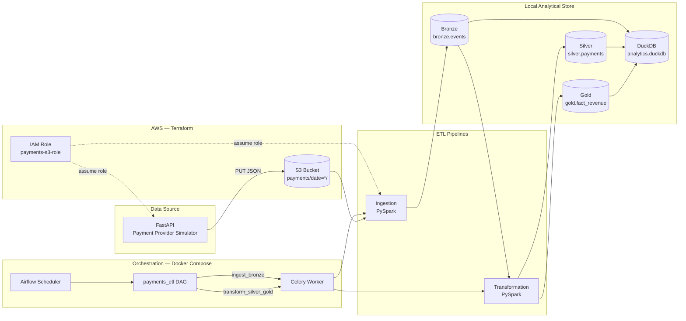

# ADR 0001: Payments Analytics Platform Architecture

## Problem Statement

We want to monitor payments made across our games. Payment transactions are received from a payment provider via a REST API. As a data analyst, I need aggregated data per game, per day metrics such as total revenue and count of successful transactions.

The payment provider exposes reports through a REST API. Requests require a **start date** (and generates data for the next 30 days). In this project, that provider API is **simulated** by a local FastAPI application that generates synthetic payment events and writes them to S3 as JSON files.

The platform must ingest raw events, transform them into analyst-ready datasets, and run on a repeatable schedule without manual intervention.

## Context

| Concern | Detail |
|---------|--------|
| **Data source** | Simulated payment-provider REST API (`app/main.py`) |
| **Raw landing zone** | AWS S3, date-partitioned JSON (`payments/date=YYYY-MM-DD/`) |
| **Processing** | PySpark for distributed read/write; DuckDB as the analytical store |
| **Orchestration** | Apache Airflow (CeleryExecutor) on Docker Compose |
| **Infrastructure** | AWS resources provisioned with Terraform |
| **Consumers** | Data analysts querying DuckDB (e.g. via Jupyter) |

## Architecture Overview



### End-to-end flow

1. **Seed data** — Call `POST /payments/seed-month` (or `POST /payments`) on the FastAPI app. Events are written to S3 under `payments/date={payment_date}/{transaction_id}.json`.
2. **Schedule** — Airflow DAG `payments_etl` runs daily (`@daily`), executing two sequential BashOperator tasks.
3. **Ingest (bronze)** — PySpark reads all JSON from `s3a://{bucket}/payments/`, writes partitioned Parquet to `data/bronze/events/`, and loads `bronze.events` in DuckDB.
4. **Transform (silver + gold)** — PySpark reads `bronze.events`, applies cleaning and FX conversion, writes silver Parquet; aggregates to gold Parquet; registers both as DuckDB tables.
5. **Analyse** — Analysts query `silver.payments` for row-level data and `gold.fact_revenue` for daily aggregates.

## Design Decisions

### 1. Medallion architecture (Bronze → Silver → Gold)

**Decision:** Adopt a three-layer medallion model stored in DuckDB with Parquet as the intermediate file format.

| Layer | Schema.Table | Purpose |
|-------|--------------|---------|
| **Bronze** | `bronze.events` | Raw events as ingested from S3; minimal transformation |
| **Silver** | `silver.payments` | Cleaned, typed, normalised amounts (`price_eur`) |
| **Gold** | `gold.fact_revenue` | Aggregated facts: revenue and transaction count per game, day, and status |

**Rationale:**
- Bronze preserves source fidelity for reprocessing and auditing.
- Silver isolates business rules (date parsing, currency conversion, column selection) from raw ingestion.
- Gold pre-computes the aggregates analysts need most often, keeping queries simple and fast.

**Trade-off:** Gold is rebuilt on each run (full refresh). Acceptable for demo scale; production would move to incremental models keyed on `payment_date`.

---

### 2. S3 as the raw data lake landing zone

**Decision:** Land all payment events as JSON in S3, partitioned by `date`.

**Rationale:**
- Mirrors how a real payment-provider export or API dump would be stored.
- Decouples the data producer (API) from consumers (ETL). The API can write independently of pipeline runs.
- S3 is durable, cheap, and natively supported by PySpark via `s3a://`.

**Format:** Each object contains a JSON array of payment events with fields: `transaction_id`, `game`, `payment_date`, `status`, `currency`, `price`.

---

### 3. FastAPI app as payment-provider simulator

**Decision:** Simulate the external payment-provider REST API with a local FastAPI service rather than calling a real third-party API.

**Rationale:**
- Removes external dependencies and API keys for local development and demos.
- `POST /payments/seed-month?start_date=YYYY-MM-DD` generates 30 days of synthetic data (5–50 events per day), matching the "provide a start date" contract.
- Same S3 write path and JSON schema as a real integration would use, so ingestion logic stays realistic.

**Trade-off:** Synthetic data only; FX rates and game catalogue are hard-coded.

---

### 4. PySpark for ingestion and transformation

**Decision:** Use PySpark for both reading S3 JSON and for silver/gold transformations.

**Rationale:**
- Spark handles semi-structured JSON and large file sets without loading everything into memory on a single machine.
- Partitioned Parquet output (`partitionBy("date")` on bronze) aligns with date-scoped analyst queries.
- Transformation logic (groupBy aggregations, conditional FX rates) maps naturally to Spark DataFrame operations.

**Trade-off:** For the current data volume, Spark adds operational weight (JVM, packages). A simpler pandas/DuckDB-only path would suffice at small scale but would not scale to production volumes.

---

### 5. DuckDB as the analytical database

**Decision:** Store all curated layers in a single DuckDB file (`data/analytics.duckdb`) and expose them as SQL schemas (`bronze`, `silver`, `gold`).

**Rationale:**
- DuckDB is embedded, requires no separate server.
- Analysts can connect with Jupyter, DBeaver, or the DuckDB CLI for ad-hoc SQL.
- `CREATE OR REPLACE TABLE ... AS SELECT * FROM read_parquet(...)` keeps table definitions in sync with the latest pipeline output.

**Trade-off:** Single-file database is not multi-user at scale. Production would likely use a warehouse (Snowflake, BigQuery, Redshift) or a shared DuckDB/MotherDuck deployment.

---

### 6. Fixed exchange rates for currency normalisation (Silver layer)

**Decision:** Convert all amounts to EUR in silver using a static rate table:

| Currency | Rate to EUR |
|----------|-------------|
| EUR      | 1.00        |
| USD      | 0.92        |
| GBP      | 1.17        |

**Rationale:**
- Enables consistent revenue comparison across games and currencies.
- Keeps transformation logic simple and deterministic for the exercise.

**Trade-off:** Rates do not reflect market reality or historical values. Production would source daily rates from a reference dataset.

---

### 7. Gold aggregation grain

**Decision:** Aggregate silver payments to `(payment_date, game, status)` with:
- `revenue` — sum of `price_eur`, rounded to 2 decimal places
- `count` — number of transactions

**Rationale:**
- Directly answers the analyst requirement for daily per-game totals.
- Including `status` allows filtering successful vs failed transactions without re-aggregating silver.

**Example query:**
```sql
SELECT payment_date, game, revenue, count
FROM gold.fact_revenue
WHERE status = 'success'
ORDER BY payment_date, game;
```

---

### 8. Apache Airflow on Docker Compose for orchestration

**Decision:** Orchestrate ingestion and transformation as a single Airflow DAG (`payments_etl`), running in Docker Compose.

| Task | Command |
|------|---------|
| `ingest_bronze` | `python /opt/softgame/ingestion/main.py` |
| `transform_silver_gold` | `python /opt/softgame/transformation/main.py` |

Dependency: `ingest_bronze >> transform_silver_gold`

**Rationale:**
- Airflow provides scheduling (`@daily`), retries, monitoring UI, and task dependency management.
- Docker Compose bundles Airflow, Postgres (metadata), Redis (broker), scheduler, worker, and API server for local development.

**Trade-off:** Docker Compose is not production-grade orchestration. A managed Airflow (MWAA, Astronomer) or Kubernetes deployment would be required for production.

---

### 9. Custom Airflow image with pipeline dependencies

**Decision:** Extend `apache/airflow:3.2.2` via `Dockerfile` to install `boto3`, `duckdb`, `pyarrow`, and `pyspark`.

**Rationale:**
- Pipeline scripts need the same dependencies whether run locally (`uv run`) or inside Airflow workers.
- Project code is mounted as volumes (`ingestion/`, `transformation/`, `data/`) so DAG changes do not require image rebuilds.

---

### 10. Terraform for AWS infrastructure

**Decision:** Provision AWS resources with Terraform under `terraform/`.

| Resource | Purpose |
|----------|---------|
| `aws_s3_bucket.payments` | Raw JSON landing bucket |
| `aws_iam_role.payments` | Role assumed by API and ETL for S3 access |
| `aws_iam_user_policy` | Allows `payment-user` to assume the role |
| `aws_s3_bucket_policy` | Grants the role read/write/list on the bucket |

**Rationale:**
- Infrastructure as code makes environments reproducible and documents the security model.
- STS role assumption (`AssumeRole`) limits blast radius: base credentials only need `sts:AssumeRole`; S3 permissions live on the role.

**Region:** `eu-central-1` (default).

---

### 11. IAM: role assumption instead of long-lived S3 credentials

**Decision:** Both the FastAPI app and the ingestion pipeline call `sts.assume_role()` before accessing S3.

**Rationale:**
- Matches AWS best practice for cross-service access.
- Temporary credentials expire automatically, reducing credential exposure risk.

---

### 12. Full refresh over incremental processing

**Decision:** Both ingestion and transformation use `mode("overwrite")` for Parquet writes and `CREATE OR REPLACE TABLE` in DuckDB.

**Rationale:**
- Simplest correct implementation for a demo with bounded data volume.
- Avoids merge/upsert complexity and stale-partition edge cases.

**Trade-off:** Does not scale to large historical datasets. Incremental loads keyed on `payment_date` would be the next evolution.

## Component Map

```
softgame/
├── app/main.py                  # Payment-provider simulator (FastAPI → S3)
├── ingestion/main.py            # S3 JSON → Parquet → bronze.events
├── transformation/main.py       # bronze → silver.payments → gold.fact_revenue
├── airflow/dags/payments_etl_dag.py
├── terraform/                   # S3 bucket, IAM role, policies
├── docker-compose.yml           # Airflow cluster (CeleryExecutor)
├── Dockerfile                   # Airflow image with ETL dependencies
└── data/
    ├── analytics.duckdb         # DuckDB warehouse
    ├── bronze/events/           # Partitioned Parquet (raw)
    ├── silver/payments/         # Parquet (cleaned)
    └── gold/fact_revenue/       # Parquet (aggregated)
```

## Consequences

### Positive

- Clear separation between raw ingestion, business transformation, and reporting layers.
- Analysts get both detail (`silver.payments`) and summary (`gold.fact_revenue`) without touching S3 or Spark.
- Reproducible local stack: Terraform for AWS, Docker Compose for Airflow, `uv` for local development.
- Pipeline is schedulable, observable, and retryable via Airflow.

### Negative / Risks

- **Single-node DuckDB** limits concurrent analyst access.
- **Full refresh** will become slow as data grows.
- **Static FX rates** produce inaccurate cross-currency revenue figures.
- **Synthetic source** does not exercise real API pagination, rate limits, or schema drift.
- **Spark overhead** is heavy relative to current data size.

### Follow-up decisions (out of scope)

- Incremental ingestion partitioned by `payment_date`.
- Data quality checks (Great Expectations / Airflow datasets) on bronze and silver.
- Replace fixed FX rates with a daily reference table.
- Move DuckDB to a shared warehouse for production analytics.
- Secrets management (AWS Secrets Manager / SSM) instead of `.env` files.

## References

- [README](../../README.md) — local run instructions
- [payments_etl DAG](../../airflow/dags/payments_etl_dag.py)
- [Terraform outputs](../../terraform/outputs.tf) — `bucket_name`, `role_arn`
